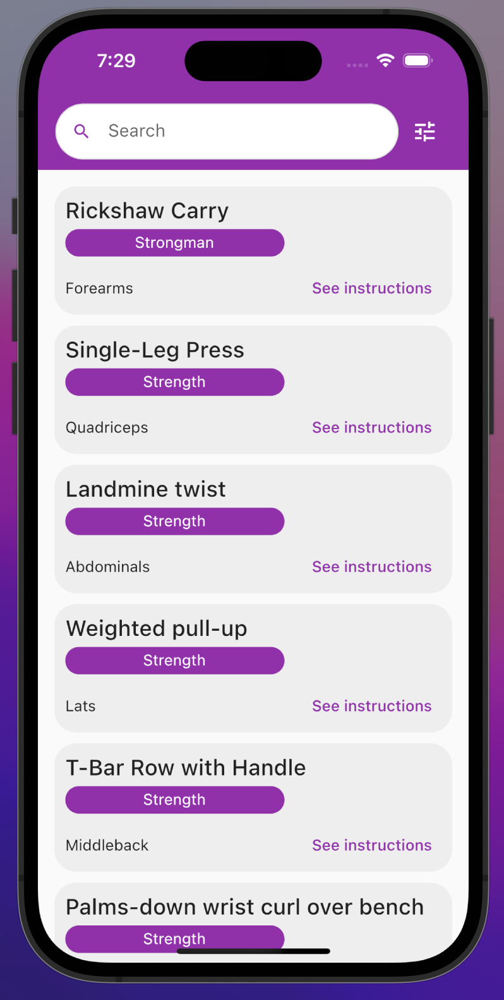
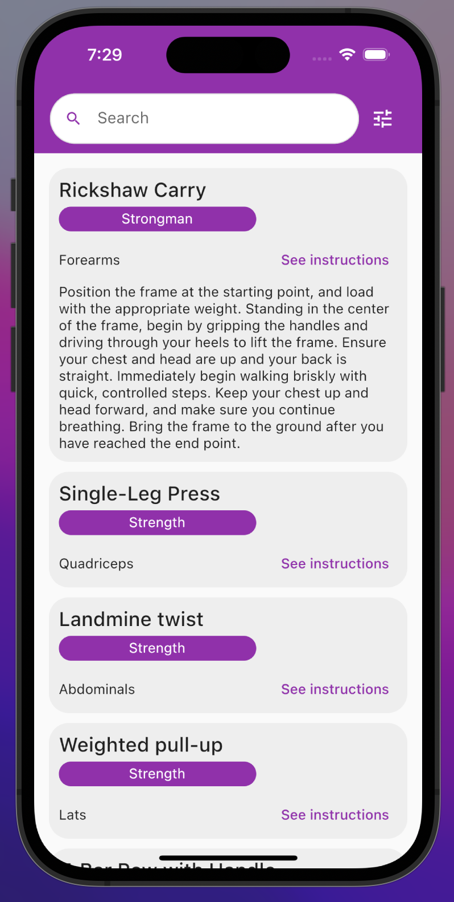
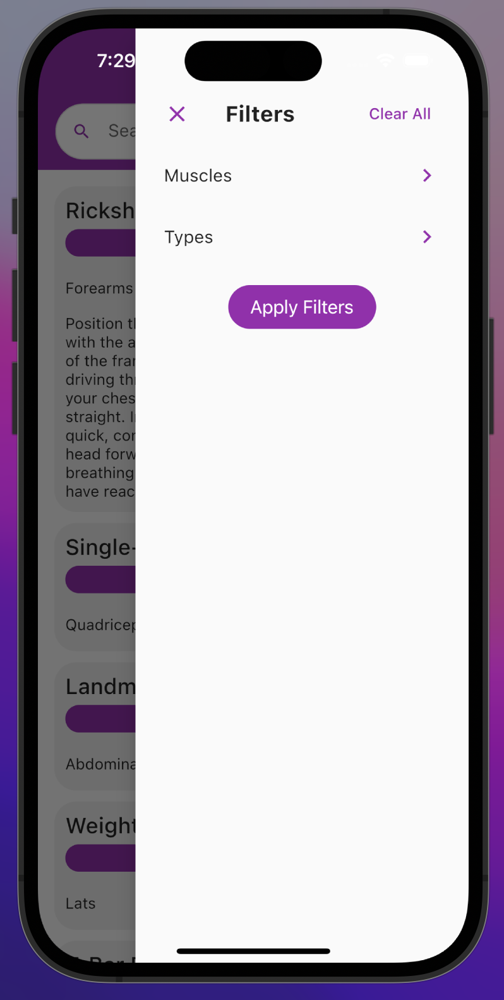
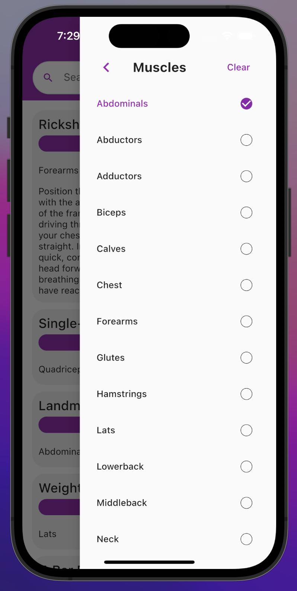
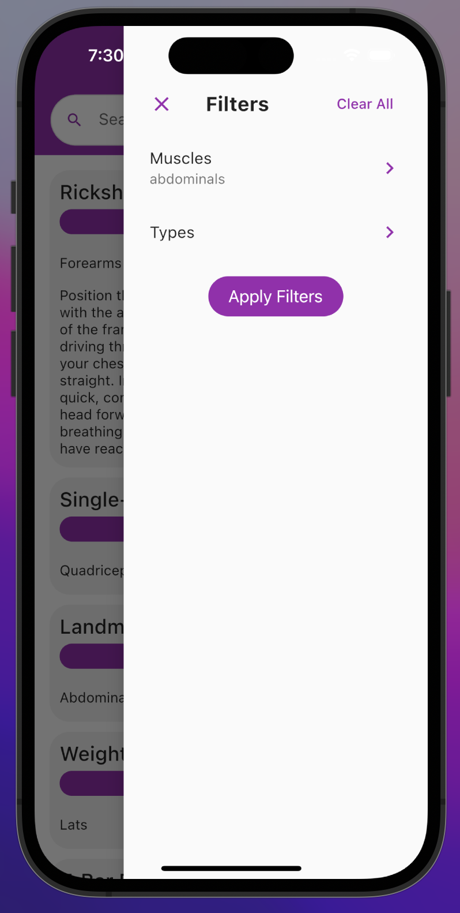
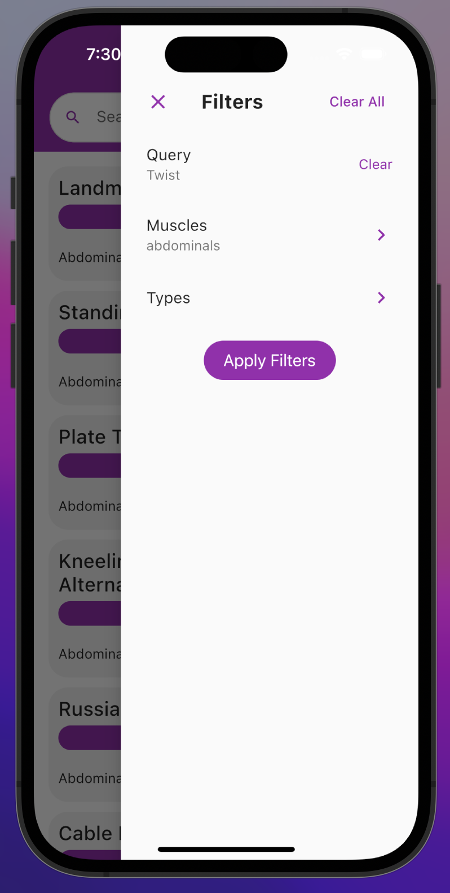

# Exercise Finder

Exercise finder app using [Exercises By API Ninjas](https://rapidapi.com/apininjas/api/exercises-by-api-ninjas/). Developed with Flutter. By [Burak Cabadan](https://burakcbdn.me)

### Use the app

[Exercise Finder](https://exercise-finder-tau.vercel.app/#/)

## Screenshots

